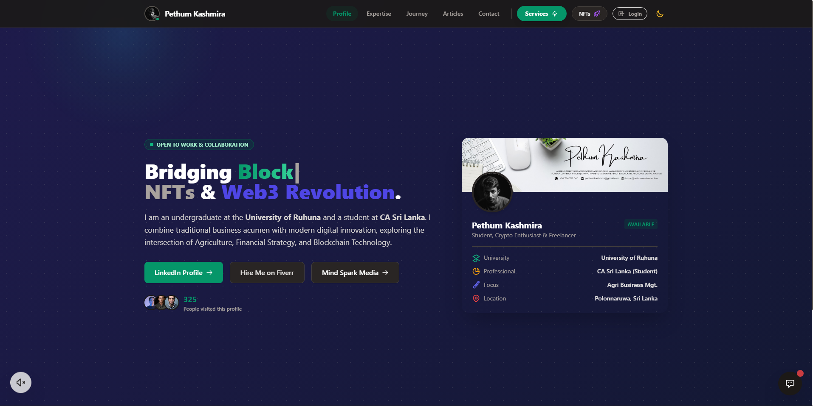
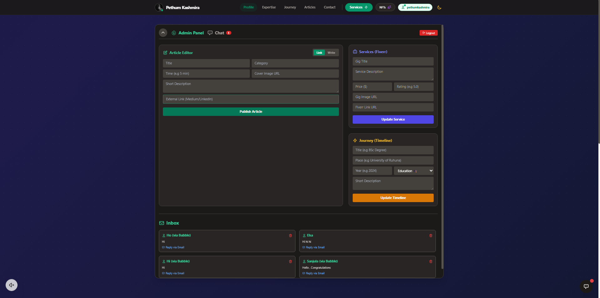

   

  
  
  
  
  

    

  

 

---

### 🎯 The Vision & Goal

I built this platform with a singular mission: **To bridge the gap between Traditional Industries and Modern Technology.**

As an **Agri-Business Undergraduate** and **Web3 Enthusiast**, I realized that the future belongs to those who can connect dots. This website serves as:
1.  **A Digital Identity:** Showcasing that a business management student can also be a top-tier Full Stack Developer.
2.  **A Knowledge Hub:** Sharing insights on Financial Strategy, Crypto, and Tech via the built-in article system.
3.  **A Service Portal:** Connecting clients with my freelance services directly.

---

### 💎 Premium Features

This isn't just a static site. It is a fully functional Web Application.

| Feature | Description |
| :--- | :--- |
| **🛡️ Admin CMS** | A custom-built Content Management System. I can **Add, Edit, and Delete** articles, services, and timeline events directly from the dashboard without touching code. |
| **💬 Live Chat System** | A real-time messaging widget powered by **Firebase Firestore Listeners**. Visitors can chat with me instantly, and I can reply via the Admin Panel. |
| **🪙 Crypto Ticker** | Integrated **CoinGecko API** to show live cryptocurrency prices, reflecting my interest in the Web3 financial world. |
| **📝 Article Reader** | A dedicated blog reader with a clean UI, allowing users to read my thoughts on Agri-Tech and Finance without leaving the site. |
| **🔐 Secure Auth** | Admin routes are protected by **Firebase Authentication**, ensuring only I can access the dashboard. |

---

### 🎨 Design & Aesthetics (Visual Experience)

The User Interface (UI) focuses on **Glassmorphism** and **Interactivity**.

| **✨ Glass Effect** | **🎭 Animated SVGs** | **🖱️ Mouse Glow** |
| :---: | :---: | :---: |
|  |  |  |
| Modern frosted glass cards using `backdrop-filter`. | Custom SVG icons that animate on hover (No Emojis). | A dynamic glow effect that follows the user's cursor. |

 

---

### 🛠️ Tech Stack

  

---

### 📸 Project Snapshots

  <table>
    <tr>
      <td align="center"><b>🏠 Immersive Hero Section</b></td>
      <td align="center"><b>⚙️ Powerful Admin Dashboard</b></td>
    </tr>
    <tr>
      <td></td>
      <td></td>
    </tr>
  </table>

---

 

